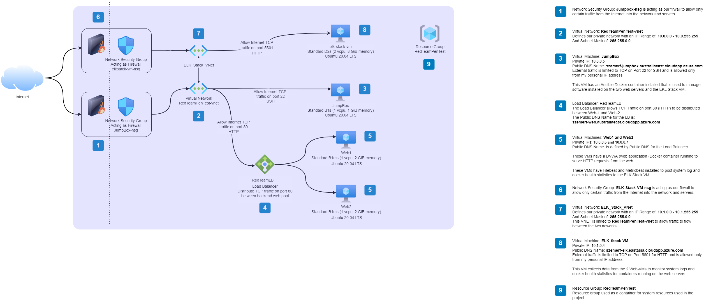
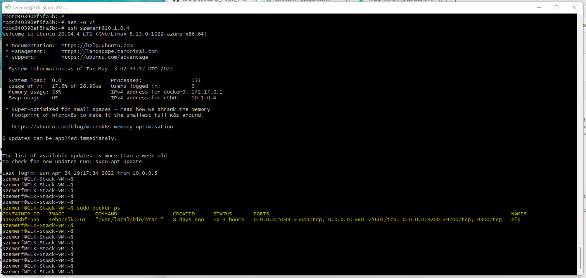

# Bootcamp_Project_1
Vanderbilt Cybersecurity Bootcamp Azure Project

## Automated ELK Stack Deployment

The files in this repository were used to configure the network depicted below.

These files have been tested and used to generate a live ELK deployment on Azure. They can be used to either recreate the entire deployment pictured above. 
There are three Anisble playbooks used to install the ELK componets and the web server components to monitor.

___NOTE___: The Ansible scripts do not automatically provision the servers pictured above, they install the software components installed on the servers.

  - [Ansible/pentest.yml](Ansible/pentest.yml) - This playbook installs Docker and an DVWA Docker container that opens ports 80 to accept This playbook is published to web servers: _Web1_ and _Web2_.
  - [Ansible/install_elk.yml](Ansible/install_elk.yml) - This playbook installs Docker and an ELK Docker container that opens ports 5601, 9200, and 5044 to accept calls from the web servers posting log and docker health data.  This playbook is published to ELK server: _szemerf-elk.eastasia.cloudapp.azure.com_.
  - [Ansible/filebeat-playbook](Ansible/filebeat-playbook.yml) - This playbook installs the components required to submit system logs from the web servers to the ELK server.  The playbook is published to the Web Servers: _Web1_ and _Web2_.
  - [Ansible/metricbeat-playbook](Ansible/metricbeat-playbook.yml) - This playbook installs the components required to submit web server docker container health statistics from the web servers to the ELK server.  The playbook is published to the Web Servers: _Web1_ and _Web2_.

This document contains the following details:
- Description of the Topology
- Access Policies
- ELK Configuration
  - Beats in Use
  - Machines Being Monitored
- How to Use the Ansible Build

### Description of the Topology

The main purpose of this network is to expose a load-balanced and monitored instance of DVWA, the D*mn Vulnerable Web Application.

Load balancing ensures that the application will be highly __available__, in addition to restricting __access__ to the network.
- Load balancers distribute configure IP traffic to a pool of back-end servers, in this case, TCP traffic on port 80 is distributed between healthy servers in our back-end pool which consists of the two web servers.  A jump box is designed to allow SSH traffic from a specific network (or in our case, a specific IP address) to limit the number of servers exposed to internet SSH traffic, thus lowering exposure to our ELK and Web Servers from outside attacks.

Integrating an ELK server allows users to easily monitor the vulnerable VMs for changes to the __configuration__ and system __logs__.
- Filebeat on our system is configured to monitor System Logs on our 2 Web Server VMs.  According to Kibana documentation, this includes system logs, Linux Authorization logs, sudo logs, and details on creation of users and groups.
- Metricbeat collects Docker Container health statistics on the 2 Web servers.  According to Kibana documentation, this includes way too many things to list here, but highlights are: Container Size, Disk and I/O stats, CPU usage stats, Network access stats, and a general Overview of the Docker containers on the web servers.

The configuration details of each machine may be found below.
_Note: Use the [Markdown Table Generator](http://www.tablesgenerator.com/markdown_tables) to add/remove values from the table_.

| Name         | Function   | IP Address | Operating System     | Public IP Address | DNS Name                                                                    |
|--------------|------------|------------|----------------------|-------------------|-----------------------------------------------------------------------------|
| JumpBox      | Gateway    | 10.0.0.5   | Linux (Ubunto 20.04) | 20.213.157.2      | szemerf-jumpbox.australiaeast.cloudapp.azure.com                            |
| ELK-Stack-VM | Monitoring | 10.1.0.4   | Linux (Ubunto 20.04) | 20.24.193.197     | szemerf-elk.eastasia.cloudapp.azure.com                                     |
| Web1         | DVWA Node1 | 10.0.0.6   | Linux (Ubunto 20.04) | 20.47.123.3       | szemerf-web.australiaeast.cloudapp.azure.com (Via Load Balancer: RedTeamLB) |
| Web2         | DVWA Node1 | 10.0.0.7   | Linux (Ubunto 20.04) | 20.47.123.3       | szemerf-web.australiaeast.cloudapp.azure.com (Via Load Balancer: RedTeamLB) |

### Access Policies

The machines on the internal network are not exposed to the public Internet. 

Only the __JumpBox__ machine can accept connections from the Internet. Access to this machine is only allowed from the following IP addresses:
- My Personal IP address __(not disclosed here)__

Machines within the network can only be accessed by __The Ansible Docker Container running on the JumpBox__.
- _TODO: Which machine did you allow to access your ELK VM? What was its IP address?_

A summary of the access policies in place can be found in the table below.

| Name         | Publicly Accessible | Allowed IP Addresses | Protocol/Ports/Service |
|--------------|---------------------|----------------------|------------------------|
| JumpBox      | Yes                 | My public IP Address | TCP/22/SSH             |
| ELK-Stack-VM | Yes                 | My public IP Address | TCP/5601/HTTP          |
| Web1         | Yes (Through LB)    | Any                  | TCP/80/HTTP            |
| Web2         | Yes (Through LB)    | Any                  | TCP/80/HTTP            |

### Elk Configuration

Ansible was used to automate configuration of the ELK machine. No configuration was performed manually, which is advantageous because...
- Using Ansible allows a Dev/Ops team to configure one or many servers in a consistent manner.  Once a playbook is created and tested, it can be used again to deploy the playbook to new machines as they are provisioned, eliminating the risk of errors from manual configurations and code deployment.

The playbook implements the following tasks:
- Set the Virtual Memory setting: vm.max_map_count to 262144 using the __sysctl__ command
- Install Docker using the __apt__ command
- Install the Python Package Manager (pip3) using the __apt__ command
- Install the Docker Python Module using the __pip__ command
- Download and Start the ELK Docker Container

The following screenshot displays the result of running `docker ps` after successfully configuring the ELK instance.

### Target Machines & Beats
This ELK server is configured to monitor the following machines:
- Web1 (10.0.0.6)
- Web2 (10.0.0.7)

We have installed the following Beats on these machines:
- Filebeats   (to monitor system logs)
- Metricbeats (to monitor Docker container stats)

These Beats allow us to collect the following information from each machine:
- _TODO: In 1-2 sentences, explain what kind of data each beat collects, and provide 1 example of what you expect to see. E.g., `Winlogbeat` collects Windows logs, which we use to track user logon events, etc._

### Using the Playbook
In order to use the playbook, you will need to have an Ansible control node already configured. Assuming you have such a control node provisioned: 

SSH into the control node and follow the steps below:
- Copy the _____ file to _____.
- Update the _____ file to include...
- Run the playbook, and navigate to ____ to check that the installation worked as expected.

_TODO: Answer the following questions to fill in the blanks:_
- _Which file is the playbook? Where do you copy it?_
- _Which file do you update to make Ansible run the playbook on a specific machine? How do I specify which machine to install the ELK server on versus which to install Filebeat on?_
- _Which URL do you navigate to in order to check that the ELK server is running?

_As a **Bonus**, provide the specific commands the user will need to run to download the playbook, update the files, etc._
